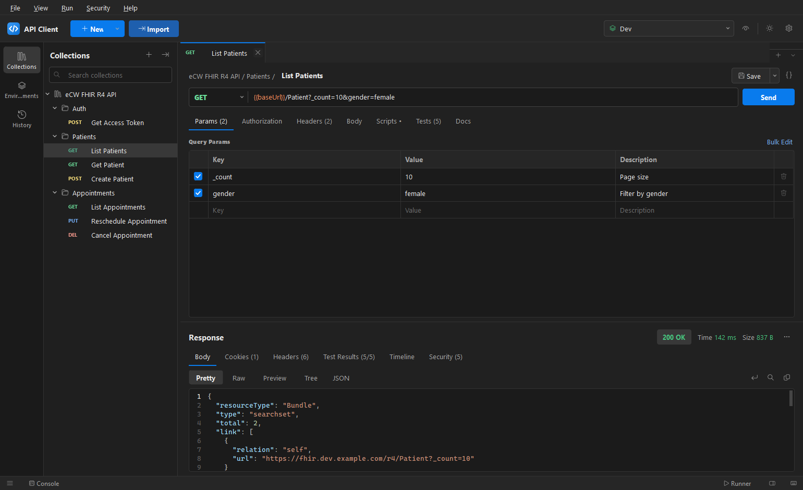
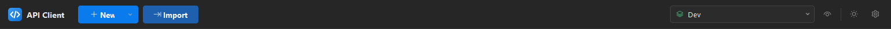
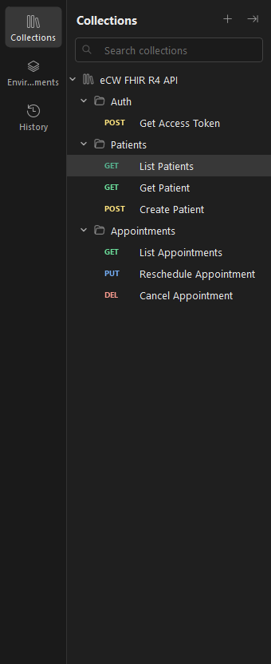

# 1. Getting started

[← Back to contents](README.md)

## The workspace

The window has four main areas:

- **Top bar** — the **New** and **Import** buttons on the left, the active-environment selector,
  environment quick-look (eye), theme toggle and settings on the right.
- **Sidebar** (left) — switch between **Collections**, **Environments** and **History** using the
  icon rail. Hide or show it with the button in the status bar or **Ctrl+\\**.
- **Request tabs** (centre) — each open request is a tab with a coloured method badge. Unsaved
  tabs show a dot; the layout is restored when you reopen the app.
- **Response panel** (below, or beside the request in two-pane mode).

## Send your first request

1. Click **New → HTTP Request**, or press **Ctrl+T**.
2. Pick the method and type a URL, e.g. `https://httpbin.org/get`.
3. Press **Send** (or **Ctrl+Enter**).
4. The response appears below with its status, time and size.

> **Tip:** paste a `curl …` command into an empty URL bar and the app turns it into a full request —
> method, headers, body and all.

## Save it into a collection

Press **Ctrl+S**. Choose (or create) a collection and folder, give the request a name, and **Save**.
Saved requests appear in the **Collections** sidebar and keep their edits between sessions.

## Where your data lives

Everything (collections, environments, history, open tabs, settings) is saved automatically under
`%LOCALAPPDATA%\APIClient`. Open it from **Help → Open Data Folder**. See
[Where your data is stored](../README.md#6-where-your-data-is-stored) for the full breakdown and the
security note about secrets being stored as plain text.

---

Next: [Building requests →](02-requests.md)
