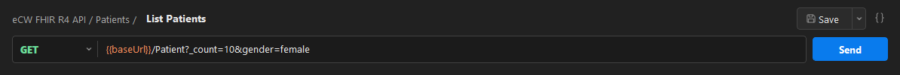
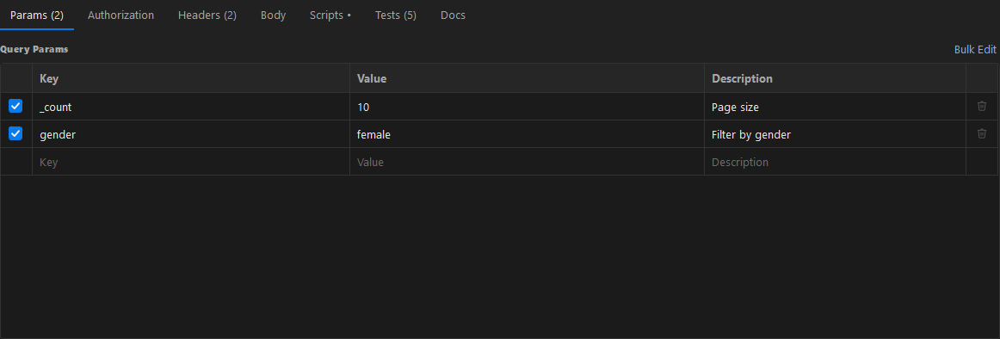
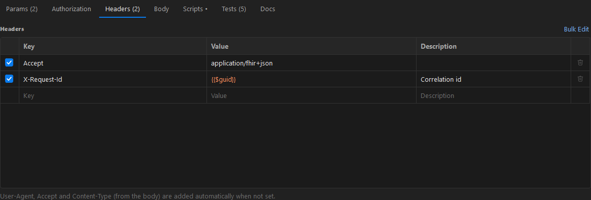
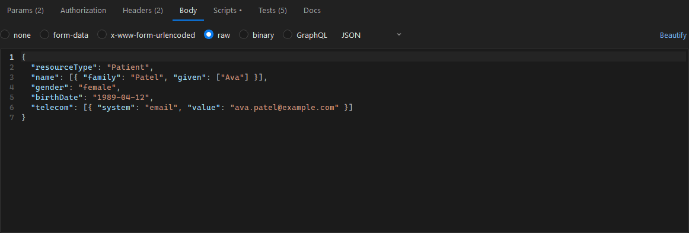
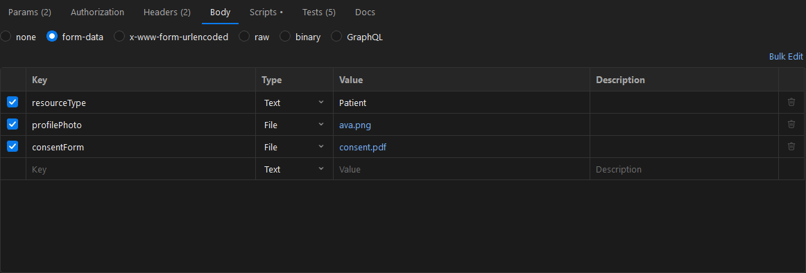
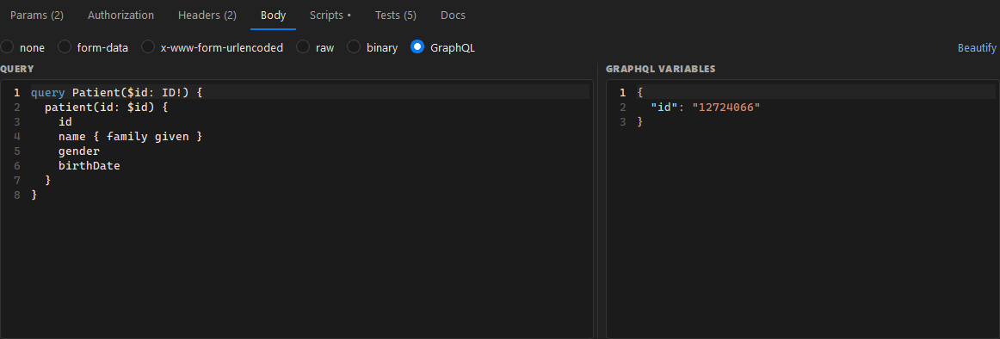
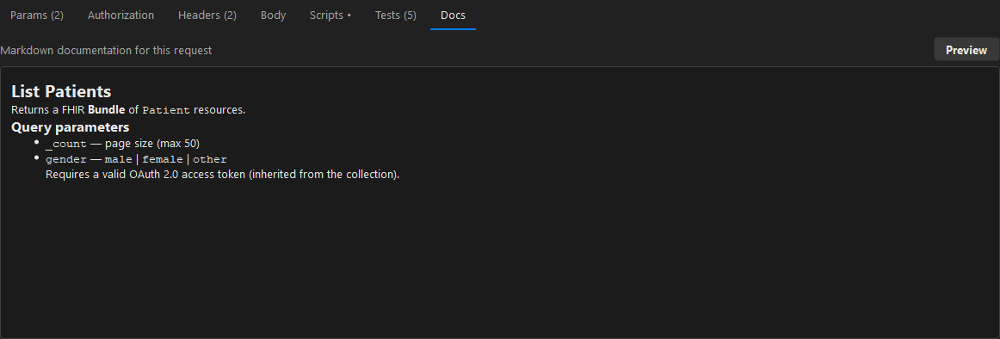

# 2. Building requests

[← Back to contents](README.md)

## The URL bar

- Pick the HTTP **method** (GET, POST, PUT, PATCH, DELETE, HEAD, OPTIONS, TRACE) from the dropdown.
- Type the URL. `{{variables}}` are highlighted — **orange** when defined, **red** when not.
  Hover one to see its value.
- Path variables written as `/Patient/:id` appear automatically in a **Path Variables** table on the
  Params tab.
- Press **Send** or **Ctrl+Enter**. **Save** (Ctrl+S) stores the request; the `{ }` button opens a
  [code snippet](06-collections.md#generate-a-code-snippet).

## Query params

The **Params** tab and the URL stay in sync — edit either and the other updates. Each row has an
enable checkbox and a description. Use **Bulk Edit** to paste many `key=value` pairs at once.

## Headers

Add request headers the same way. `User-Agent`, `Accept` and `Content-Type` (from the body) are
added automatically when you don't set them yourself.

## Request body

Choose a body type on the **Body** tab. The tab shows a dot when a body is set.

### raw (JSON / Text / XML / HTML / JavaScript)

Pick the language on the right; **Beautify** formats JSON. The correct `Content-Type` is sent
automatically.

### form-data

Send text fields and file uploads together (multipart). Switch a row's type to **File** to attach a
file from disk.

### GraphQL

Write the query on the left and JSON variables on the right; the app posts them as a GraphQL request.

Other body modes: **x-www-form-urlencoded** (key/value pairs), **binary** (send a file as the raw
body) and **none**.

## Document a request

The **Docs** tab holds Markdown documentation for the request. Toggle **Preview** to render it — handy
for describing parameters and expected responses for your teammates.

---

Next: [Authorization →](03-authorization.md)
