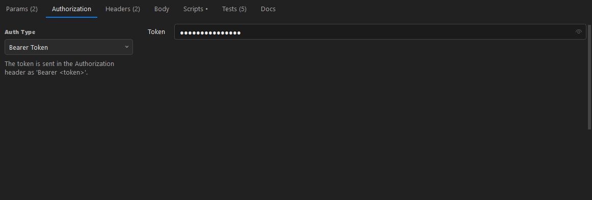
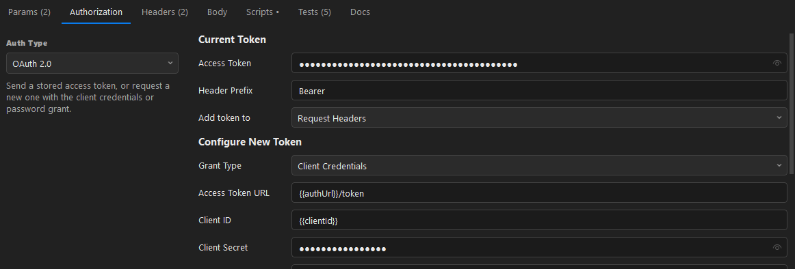
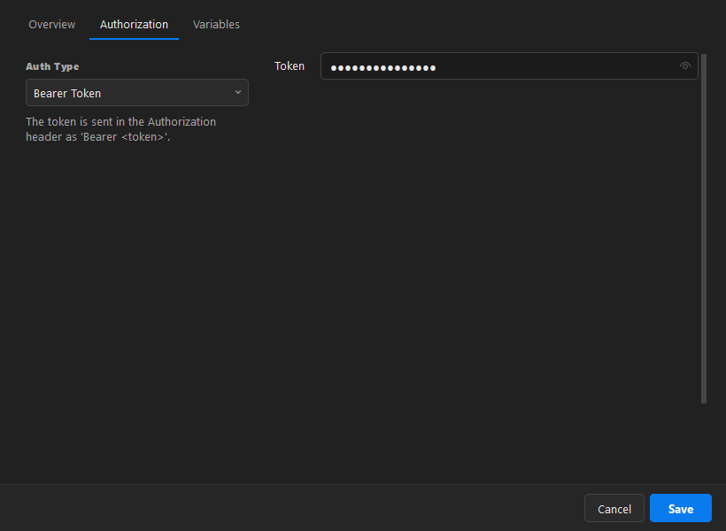

# 3. Authorization

[← Back to contents](README.md)

Set authorization on the **Authorization** tab of a request, or once on a collection/folder so every
request below it inherits the same auth.

## Per-request auth

Pick an **Auth Type**:

| Type | What it sends |
| --- | --- |
| **Inherit auth from parent** | Uses the collection's or folder's auth (the default). |
| **No Auth** | Sends nothing. |
| **API Key** | A key/value pair, added to the headers or the query string. |
| **Bearer Token** | `Authorization: Bearer <token>`. |
| **Basic Auth** | Base64 `username:password` in the `Authorization` header. |
| **Digest Auth** | HTTP Digest challenge/response. |
| **JWT Bearer** | A JWT signed locally with HMAC (HS256 / HS384 / HS512). |
| **OAuth 2.0** | A stored access token, or one fetched with a client-credentials / password grant. |

Token and password fields are masked — click the eye icon to reveal. Any value can be a
`{{variable}}`, so you can keep secrets in an environment.

## OAuth 2.0

Fill in the **Access Token URL**, **Client ID / Secret**, scope and grant type, then click
**Get New Access Token** (further down the panel). The token is stored in the **Access Token** field
and attached to every send until you replace it.

## Collection-level auth (inherited)

Right-click a collection → **Edit (auth, variables, docs)…** → **Authorization**.

Every request set to **Inherit auth from parent** then uses this automatically. The Authorization tab
on a request shows a hint telling you exactly which parent's auth it is inheriting.

---

Next: [Environments & variables →](04-environments-variables.md)
