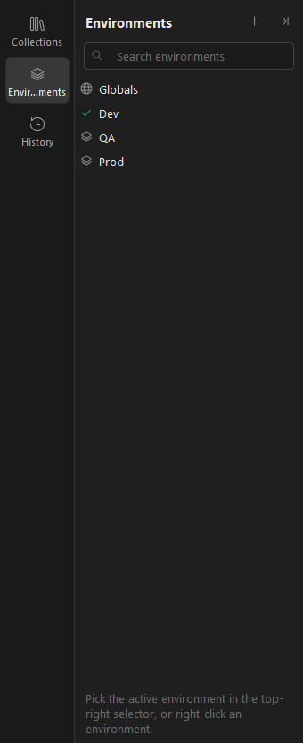
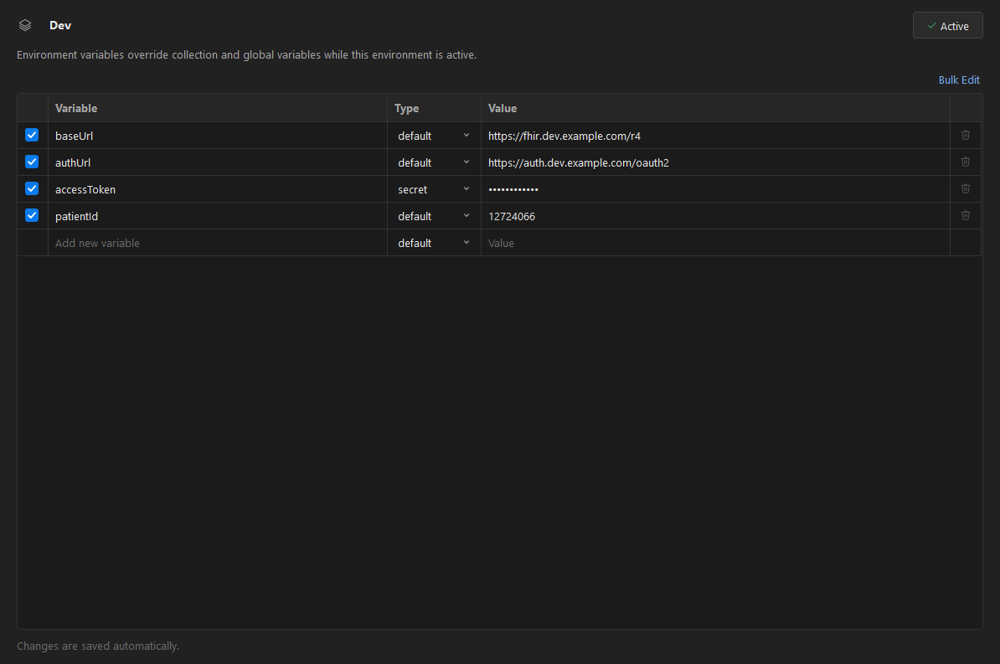
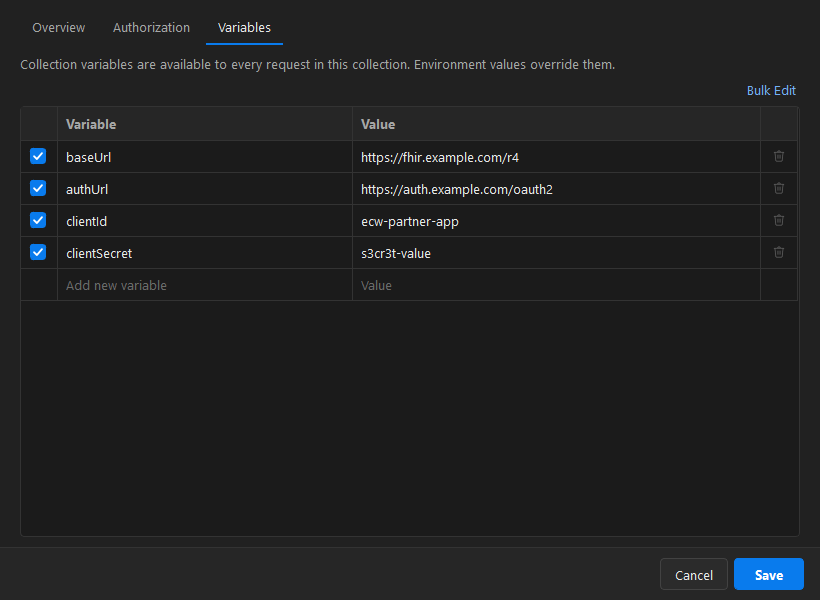
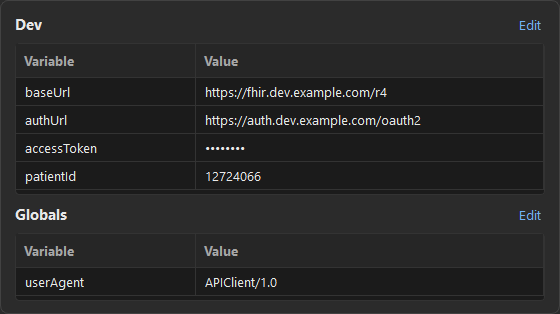

# 4. Environments & variables

[← Back to contents](README.md)

Variables let you write one request (`{{baseUrl}}/Patient`) and run it against different servers by
switching environments.

## Where variables come from

Values are resolved in this order (first match wins):

1. **Local** — set by a script during the current send
2. **Environment** — the active environment (e.g. Dev / QA / Prod)
3. **Collection** — defined on the collection
4. **Global** — available everywhere

There are also dynamic variables like `{{$guid}}`, `{{$timestamp}}` and `{{$randomEmail}}`.

## Environments (Dev / QA / Prod)

Open the **Environments** panel from the sidebar rail.

Click **New Environment**, then add variables. Mark a value as **secret** to hide it on screen.

Pick the active environment in the top-right selector (or **Set as active** here). Changes save
automatically.

## Collection variables

Right-click a collection → **Edit…** → **Variables**. These are shared by every request in the
collection; an environment of the same name overrides them.

## Quick look

Click the **eye** icon next to the environment selector to see the active environment and globals at a
glance without opening a tab.

> In the URL bar and tables, a `{{variable}}` is **orange** when defined and **red** when it isn't —
> a fast way to spot a missing `baseUrl` before you send.

---

Next: [Testing & automation →](05-testing-automation.md)
