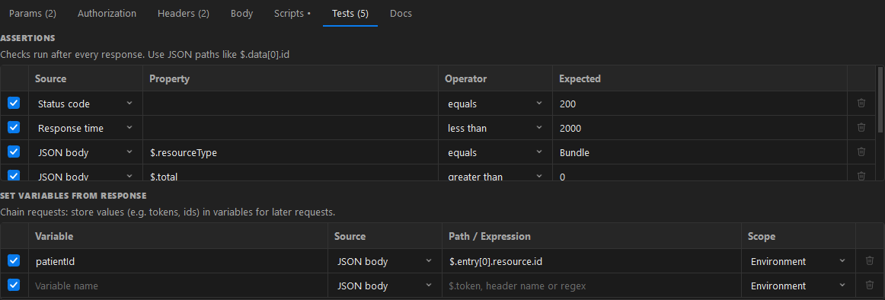
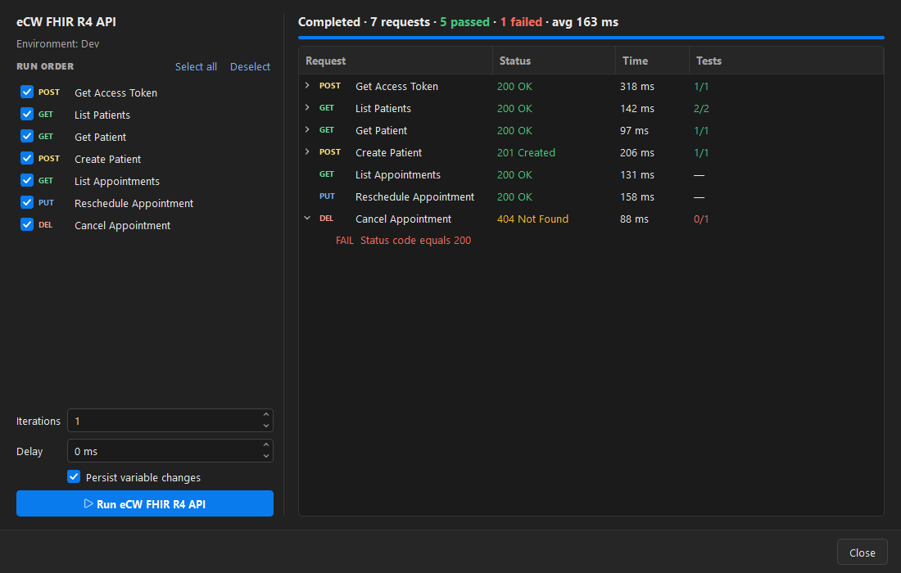

# 5. Testing & automation

[← Back to contents](README.md)

## No-code assertions

On the **Tests** tab, add assertions that run after every response.



Each assertion checks a **source** (status code, response time, a JSON path like `$.data[0].id`, a
header, the body text or the body size) with an **operator** (equals, contains, greater than, matches
regex, is type, …) against an **expected** value.

Results show up on the response's **Test Results** tab with a pass/fail count.


## Chain requests (set variables from response)

Below the assertions, **Set variables from response** rules capture values for later requests — for
example store `$.access_token` into the environment as `accessToken`, then use `{{accessToken}}` in
the next request's auth. Choose the scope (environment, collection or global) per rule.

## Scripts

The **Scripts** tab runs Python before the request (pre-request) and after the response
(post-response), using a Postman-like `pm` object. Click a snippet on the right to insert starter code.


```python
pm.test("Status is 200", pm.response.code == 200)
body = pm.response.json()
pm.environment.set("patientId", body["entry"][0]["resource"]["id"])
```

> Scripts run on your machine with your Windows permissions. Only run scripts you trust, especially in
> collections you received from someone else.

## Collection Runner

Right-click a collection or folder → **Run Collection**, or use the **Runner** button in the status
bar. Choose which requests to run and in what order, set iterations and a delay, then **Run**.



You get a live pass/fail summary and a per-request breakdown with status, time and test results.
Tick **Persist variable changes** to save values set by scripts and rules back to your
environment / collection / globals.

---

Next: [Collections, import & export →](06-collections.md)
