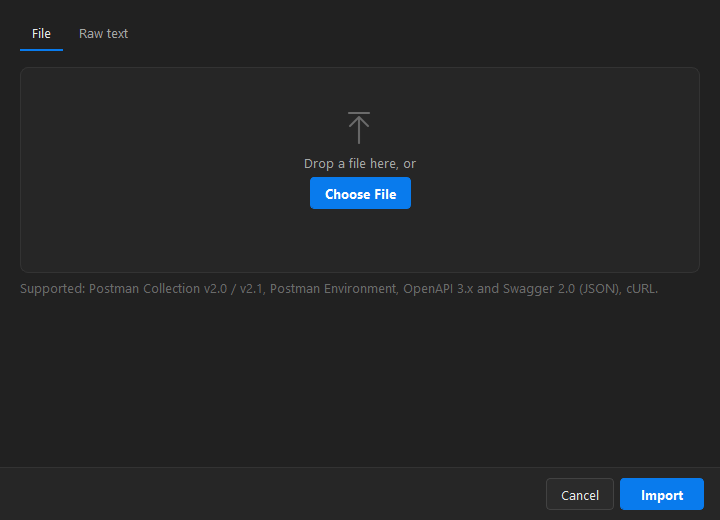
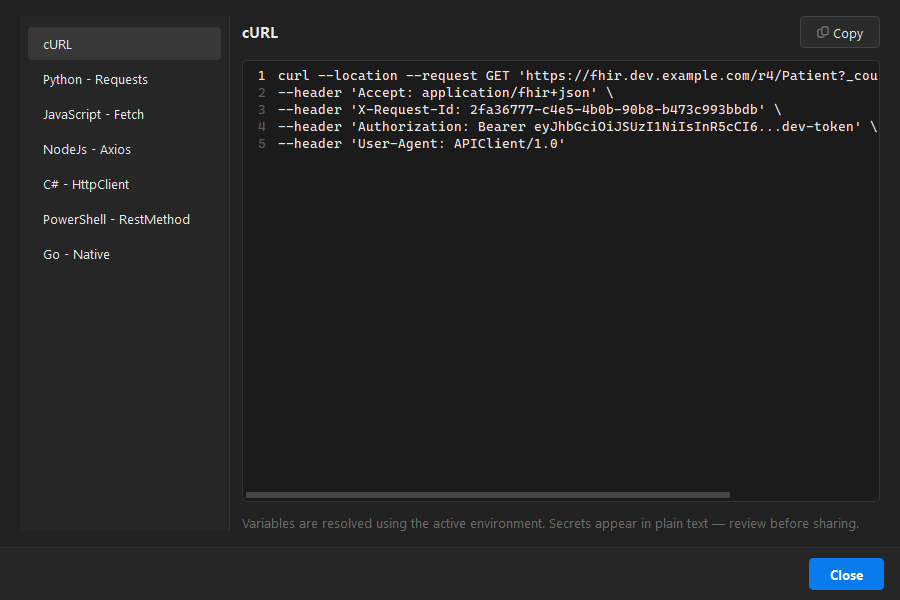
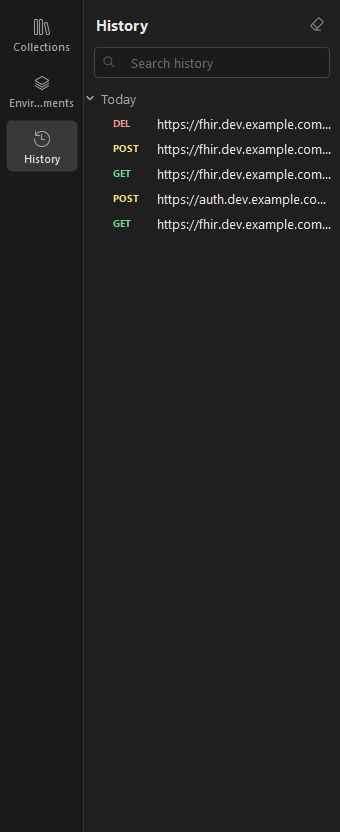

# 6. Collections, import & export

[← Back to contents](README.md)

## Organising collections

- **Collections** group related requests; **folders** nest inside them.
- **Drag and drop** requests and folders to reorder or move them between collections.
- **Right-click** a collection, folder or request for actions: add request/folder, run, rename,
  duplicate, export, edit auth/variables/docs, copy as cURL, delete.
- Click a request to open it; the method badge shows its verb (GET, POST, …).
- Use the search box to filter by name or URL.

## Import

Click **Import** (or **Ctrl+O**), or drag a file onto the window.

Supported formats:

- **Postman** Collection v2.0 / v2.1 and Postman Environment
- **OpenAPI** 3.x and **Swagger** 2.0 (JSON)
- **cURL** commands (File tab, or paste on the **Raw text** tab)

> Postman JavaScript scripts are imported as commented-out text in each request's Scripts tab — port
> them to Python (the `pm` API) to run them.

## Export

Right-click a collection → **Export…** to save it as a **Postman Collection v2.1** file, or export an
environment as a **Postman Environment**. Remove secrets before sharing — they are exported in plain
text.

## Generate a code snippet

With a request open, press **Ctrl+Shift+C** (or click the `{ }` button) to get ready-to-run code.

Pick a language — **cURL, Python, JavaScript fetch, Node axios, C# HttpClient, PowerShell, Go** — then
**Copy**. Variables are resolved using the active environment.

## History

Every request you send is recorded (last 1000) and grouped by day in the **History** panel. Click an
entry to reopen it, or right-click to save it into a collection.

---

Next: [Reading responses →](07-responses.md)
