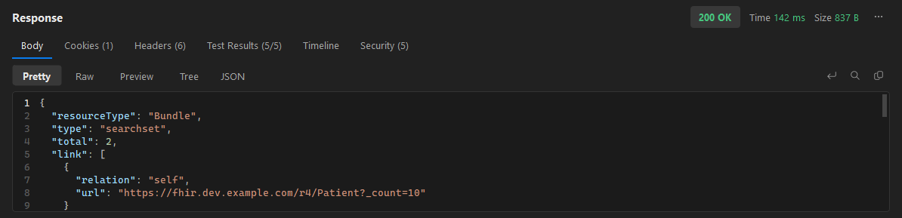
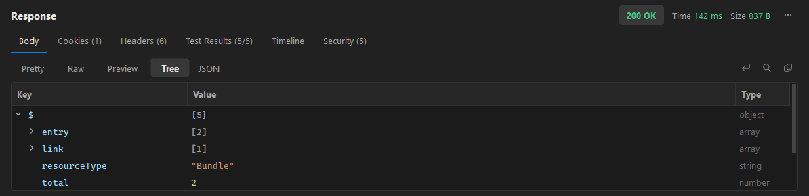
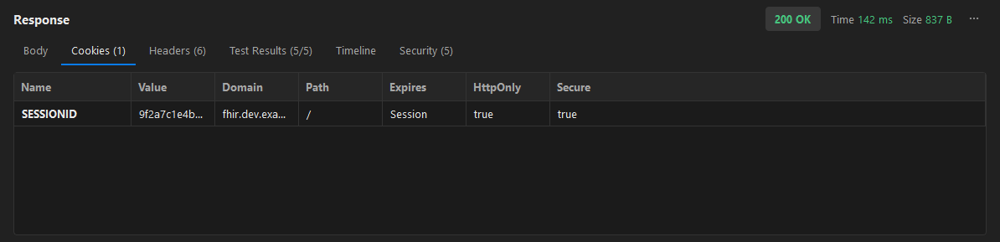
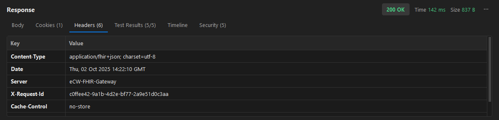
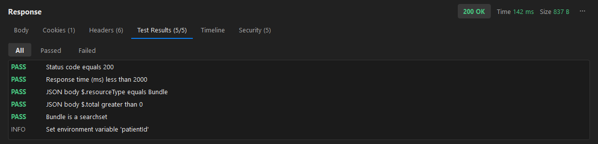
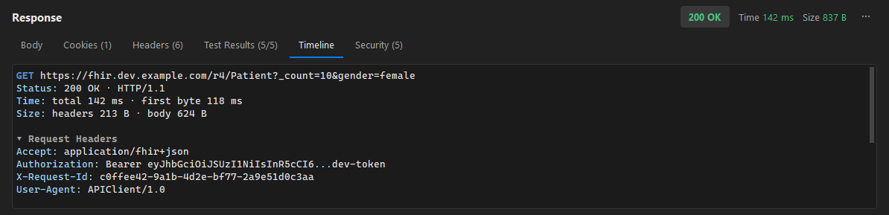

# 7. Reading responses

[← Back to contents](README.md)

When a request returns, the response panel shows the **status**, **time** and **size** in the header
(hover time and size for a breakdown), plus tabs for the body, cookies, headers, test results and a
timeline.

## Body views

Switch between four views:

- **Pretty** — formatted and syntax-highlighted (JSON, XML, HTML, JavaScript).
- **Raw** — the response exactly as received.
- **Preview** — renders HTML, or shows images inline.
- **Tree** — an expandable tree for JSON, with each value's type.

Use the toolbar on the right to **wrap** lines, **search** (Ctrl+F), or **copy** the body. The **⋯**
menu saves the response to a file.

## Cookies

Every cookie the server set, with its domain, path, expiry and the HttpOnly / Secure flags.

## Headers

All response headers. Right-click to copy a value, a row, or everything.

## Test results

Pass/fail for each assertion from the [Tests tab](05-testing-automation.md) and any `pm.test()` calls
in a post-response script. Filter by **All / Passed / Failed**.

## Timeline

A readable summary of the exchange: the final URL, status and HTTP version, timing and size, any
redirects, and the full request and response headers.

## Security

Automatic checks on every response — missing/weak security headers, insecure cookie flags, and exposed
secrets or PII in the body. See [Security testing](08-security-testing.md) for the full set of tools.

---

Next: [Security testing →](08-security-testing.md)
