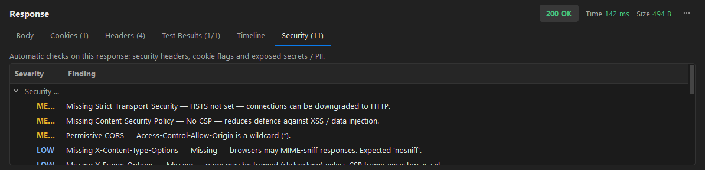
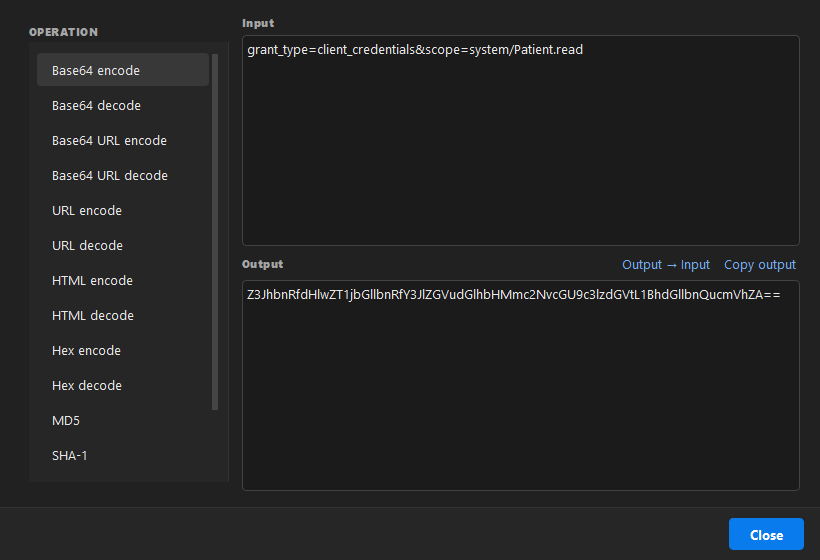
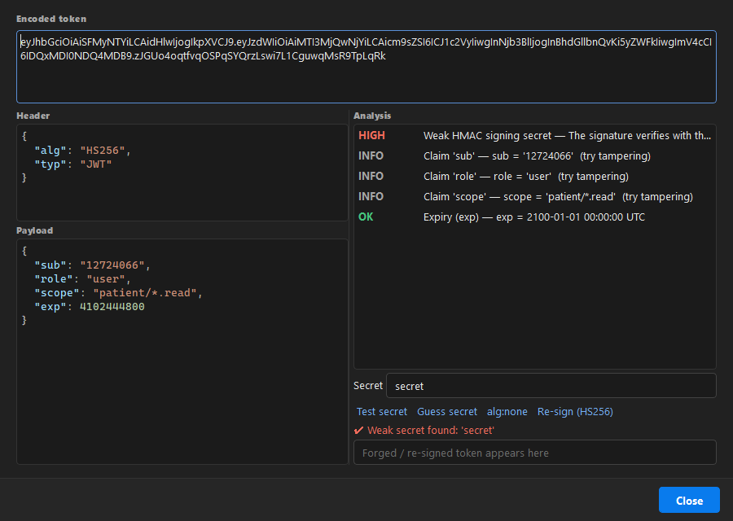
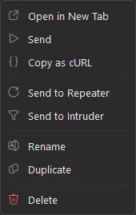
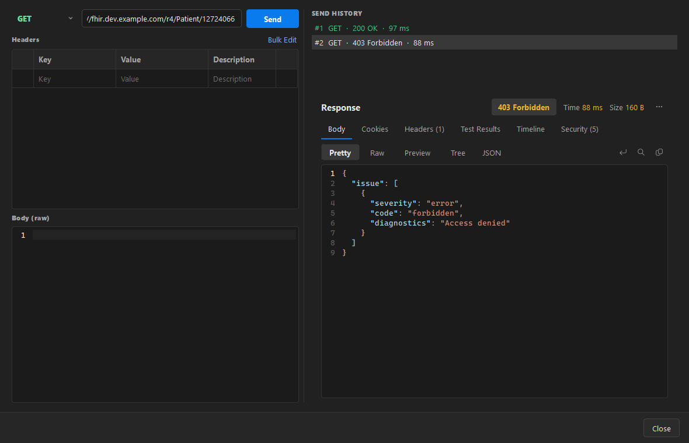
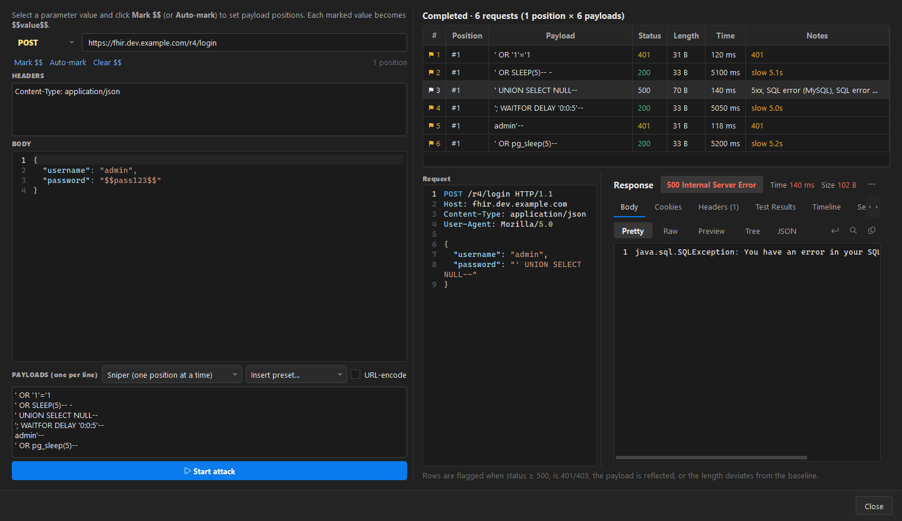
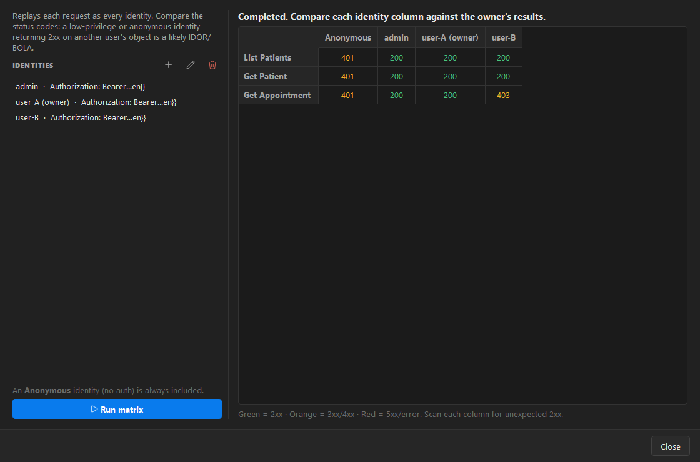
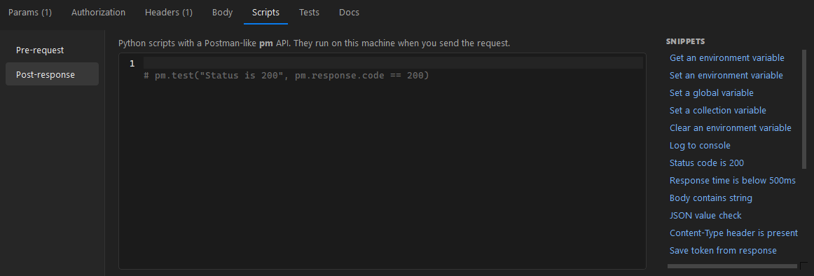

# 8. Security testing

[← Back to contents](README.md)

> **For authorized testing only.** Use these tools against systems you own or have explicit written
> permission to test. Requests and scripts run from your machine with your credentials.

The app includes a set of API security-testing tools, reachable from the **Security** menu and from the
right-click menus in the Collections sidebar.

## Response security checks (automatic)

Every response is scanned automatically. Open the **Security** tab of the response panel.

It flags, with severity:

- **Security headers** — missing/weak `Strict-Transport-Security`, `Content-Security-Policy`,
  `X-Content-Type-Options`, `X-Frame-Options`, `Referrer-Policy`, permissive/insecure CORS, and
  version disclosure (`Server`, `X-Powered-By`).
- **Cookies** — cookies missing the `Secure` / `HttpOnly` flags.
- **Error / stack-trace signatures** — SQL errors, Java/.NET/PHP/Python/Node stack traces and verbose
  debug pages leaked in the body.
- **Secrets & sensitive data** — tokens, API keys, private keys, JWTs, emails, card/SSN-like numbers,
  private IPs and high-entropy strings found in the body (values are redacted in the report).

## Encoder / Decoder & hashing

**Security → Encoder / Decoder…** — Base64 / Base64-URL / URL / HTML / Hex encode & decode, and
MD5 / SHA-1 / SHA-256 / SHA-512 hashing. Output updates as you type; **Output → Input** chains
operations.

## JWT Workbench

**Security → JWT Workbench…** — paste a JWT to decode the header and payload and get an analysis:
`alg:none`, weak HMAC secrets (dictionary check), missing/expired `exp`, and interesting claims.
Enter a secret to **Test** or **Guess** it, generate an **alg:none** token, or **Re-sign** a tampered
payload.

## Repeater

Right-click a request (in the Collections sidebar or on its tab) → **Send to Repeater** — just like
Burp Suite. You can also use **Security → Send Current Request to Repeater**.

A popup opens with the request loaded. Edit the method, URL, headers and body and resend repeatedly;
each send is kept in the **Send history** so you can flip between responses and compare.

## Intruder (fuzzer)

Right-click a request → **Send to Intruder**. The full request is loaded — method, URL, headers and
body (in its original form: raw/JSON, `x-www-form-urlencoded` or form-data).

**Mark the parameters to attack** (Burp-style):

1. **Select a parameter's value** in the URL, headers or body and click **Mark $$** — it wraps the
   value as `$$value$$`. Do this for each position you want to fuzz. Or click **Auto-mark** to wrap
   every query/body parameter value at once. **Clear $$** removes all markers.
2. Choose the **attack type**:
   - **Sniper** — fuzz one marked position at a time (others keep their original value).
   - **Battering ram** — put the same payload in every marked position at once.
3. Paste payloads or **Insert preset…** (SQLi, XSS, path traversal, command injection, SSTI, NoSQL,
   boundary numbers); optionally **URL-encode** them. Then **Start attack**.

Results show the position, payload, status, response length and time, plus a **Notes** column that
auto-flags interesting responses:

- **Error / stack-trace signatures** — SQL errors (MySQL/Postgres/MSSQL/Oracle/SQLite), Java/.NET/PHP/
  Python/Node stack traces and verbose debug pages detected in the body.
- **Time-based / blind** — responses that are much slower than the baseline (or `SLEEP`/`WAITFOR`/
  `pg_sleep`-style payloads that delayed the response) are flagged `slow 5.1s`, a signal for blind SQLi
  or command injection. The **Time-based blind** payload preset ships ready-to-use.
- Also flagged: `5xx`, `401/403`, reflected payloads, and length deviation from the baseline.

In the example above, the time-based payloads against the `password` parameter return `slow 5.x s` and
one returns a SQL error — strong blind-SQLi signals.

**Select any result row** to see its full **request and response** below the table (same request/response
view as the proxy) — so you can confirm exactly what each payload sent and returned.

## IDOR / BOLA matrix

Right-click a collection → **IDOR / BOLA Matrix…**. Add **identities** (a header such as
`Authorization: Bearer …`, which can use a `{{variable}}`); an **Anonymous** (no-auth) identity is
always included. **Run matrix** replays every request as every identity.

Read each column: a low-privilege, other-user or anonymous identity returning **2xx** on another
user's object is a likely **broken object-level authorization** (IDOR/BOLA). Colours: green = 2xx,
orange = 3xx/4xx, red = 5xx/error.

## Security assertions in scripts

The **Scripts** tab includes ready-made security checks in the snippet list (no stack trace, `nosniff`,
HSTS present, CORS not wildcard, unauthorized-without-token, scan body for secrets), so you can bake
them into the Tests results and run them across a collection with the [Runner](05-testing-automation.md).

---

[← Back to contents](README.md)
