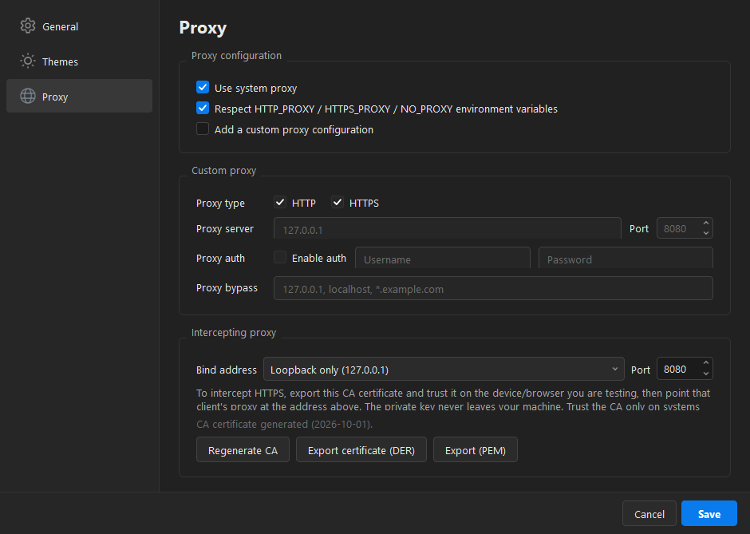
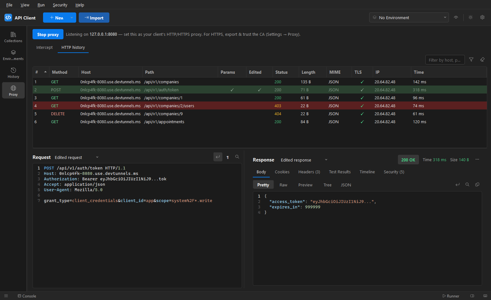
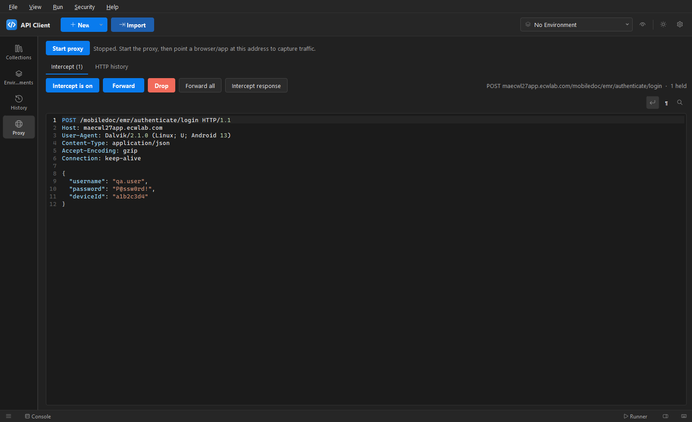
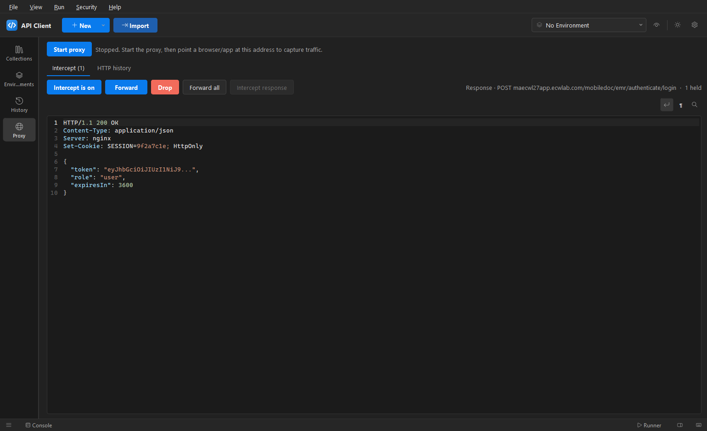
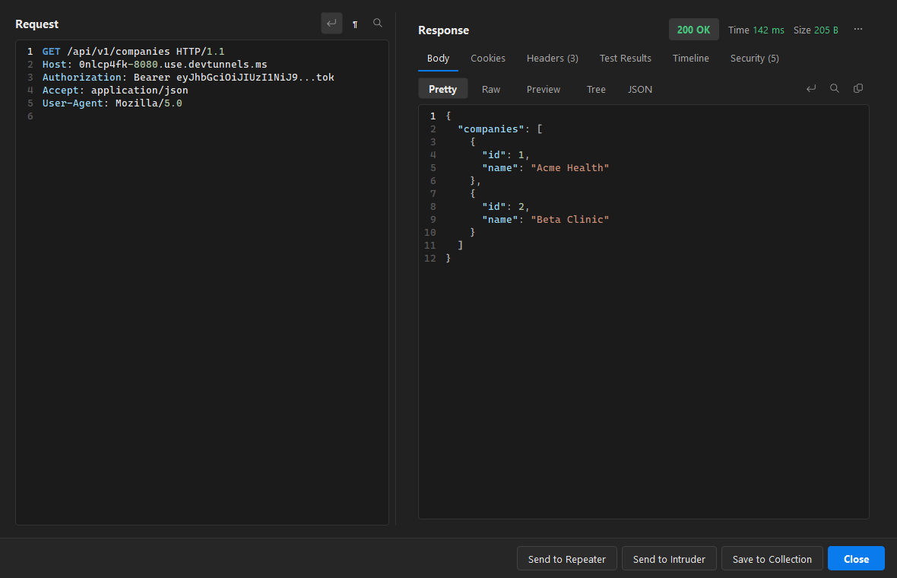
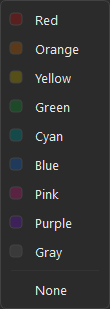
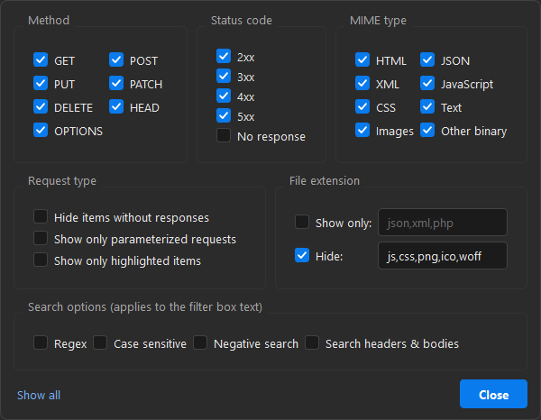

# 9. Proxy & traffic interception

[← Back to contents](README.md)

> **For authorized testing only.** Intercept traffic only from devices/apps you own or are explicitly
> permitted to test, and trust the CA only on such machines. The CA private key stays on your computer.

The app has a built-in intercepting proxy (like Burp's): point a browser or app at it, and every
request/response is captured into a live list you can inspect and send to the Repeater or Intruder.

## Step 1 — Generate & trust the CA (for HTTPS)

Open **Settings → Proxy → Intercepting proxy**.

1. Choose the **Bind address**:
   - **Loopback only (127.0.0.1)** — default; only this machine can use the proxy.
   - **All interfaces (0.0.0.0)** or a specific LAN IP — lets other devices (e.g. a phone on the same
     Wi-Fi) route through it. ⚠ This makes the app an **open proxy** on your network — use only on
     networks you trust.
2. Set the **listen port** (default `8080`).
3. Click **Generate CA** (first time only).
4. **Export certificate (DER)** or **Export (PEM)** and **install/trust** it on the device/browser you
   will test (Windows: *Trusted Root Certification Authorities*).

Plain **HTTP** needs no certificate — only HTTPS interception does.

## Step 2 — Start the proxy & point your client at it

Select **Proxy** in the sidebar rail (the capture view opens in the main area) and click **Start proxy**.
Then set your client's HTTP/HTTPS proxy to the **listening address** shown (e.g. `127.0.0.1:8080`, or
your LAN IP when bound to all interfaces).

The Proxy section has two sub-tabs: **Intercept** (hold/edit requests) and **HTTP history** (everything
that has passed through).

Traffic streams into the **HTTP history** list with columns for **#, Method, Host, Path, Params,
Edited, Status, Length, MIME, TLS, IP** and **Time** — colour-coded, with ticks for requests that have
parameters, were **edited** during interception, and used **TLS**. **Click a column header** to sort
(numeric for #, Status, Length and Time). Use the **filter** box to narrow by host/path/method.

## Intercept mode (hold → edit → forward / drop)

On the **Intercept** tab, click **Intercept is off** to turn it **on**. Now each request **pauses** here
before it is sent — you can read it, **edit the raw request** (method, path, headers, body), then act:

- **Forward** — send the (edited) request on and capture the response in HTTP history.
- **Drop** — abandon it (the client gets a `502`).
- **Forward all** — release the current request plus everything queued behind it.
- **Intercept response** — also hold this request's **upstream response** before it reaches the client.
  Toggle the **Intercept response** button, or **right-click the request → Do intercept → Response to
  this request** (Burp-style). Then **Forward**; the response pauses here next as an editable raw
  response — tamper with status/headers/body and **Forward** again.

  

- Turning **Intercept off** forwards anything still held, so traffic never gets stuck.

The tab title shows how many requests are **held** (e.g. *Intercept (1)*), and the section jumps here
automatically when a new request is caught.

## Step 3 — Inspect & attack

- **Click a row** to see the full exchange below: the raw **Request** on the left and the **Response**
  on the right (with the same Pretty/Raw/Preview/Tree views, cookies, headers and automatic
  [Security](08-security-testing.md) checks as a normal response). Double-click to pop it out.
  The Request view syntax-highlights the method, headers, query/body **parameters** and JSON, and has
  **wrap**, **show-whitespace (¶)** and **find (Ctrl+F)** controls. If a request was edited during
  interception, an **Edited request / Original request** dropdown lets you compare the two — and if the
  **response** was edited, an **Edited response / Original response** dropdown does the same for it.

  

- **Right-click** a captured call (select several with Ctrl/Shift for bulk actions) for the Burp-style
  actions:
  - **Send to Repeater** — resend/edit it rapidly.
  - **Send to Intruder** — mark parameters and fuzz.
  - **Save to Collection** — keep it for later.
  - **Highlight** — colour the row (red, orange, yellow, green, cyan, blue, pink, purple, gray, or
    *None* to clear) to mark interesting calls.
  - **Copy URL** / **Delete**.

  

Captured responses also run the automatic [Security checks](08-security-testing.md) (headers, secrets,
error signatures) in their **Security** tab.

## Filtering the history

Type in the toolbar box for a quick host/path/method search, or click the **funnel** button for the
full filter (the icon turns blue while a filter is active):

- **Method**, **Status code** (2xx/3xx/4xx/5xx/no-response) and **MIME type** (HTML, JSON, XML,
  JavaScript, CSS, Text, Images, Other binary) checkboxes.
- **File extension** — *Show only* or *Hide* a comma-separated list (e.g. hide `js,css,png,ico,woff`).
- **Request type** — hide items without responses, show only parameterized requests, or show only
  highlighted items.
- **Search options** for the toolbar text — **Regex**, **Case sensitive**, **Negative search**, and
  **Search headers & bodies** (otherwise the search matches method/host/path only).
- **Show all** resets every filter.

## Notes & limits

- **HTTP** works with no certificate; **HTTPS** requires the client to **trust the generated CA**.
- Apps using **certificate pinning** won't be interceptable even with the CA trusted.
- The client must be able to reach `127.0.0.1:<port>` — same machine, or the proxy host's LAN address
  for other devices.
- The CA's **private key never leaves** your machine; only the public certificate is exported.

---

[← Back to contents](README.md)
