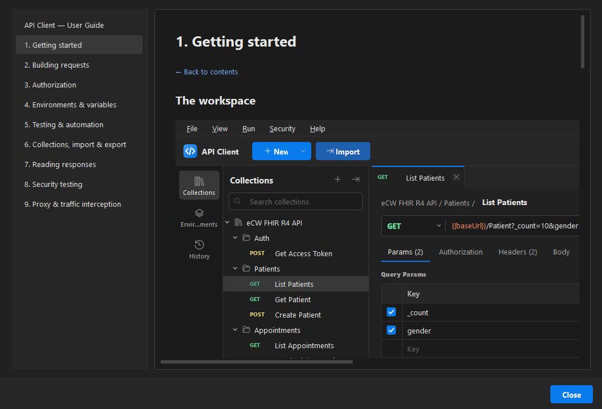

# API Client — User Guide

An illustrated walkthrough of the API Client desktop app. If you just want to install and
run it, start with the [main README](../README.md); this guide covers how to **use** the app
once it is open.

> You can read this guide **inside the app**: **Help → Documentation** (or press **F1**).
>
> 

## Contents

1. [Getting started](01-getting-started.md) — the workspace, sending your first request, saving it
2. [Building requests](02-requests.md) — URL, method, params, headers and every body type
3. [Authorization](03-authorization.md) — API key, Bearer, Basic, Digest, JWT and OAuth 2.0
4. [Environments & variables](04-environments-variables.md) — Dev / QA / Prod, `{{variables}}`, globals
5. [Testing & automation](05-testing-automation.md) — assertions, chaining, scripts and the runner
6. [Collections, import & export](06-collections.md) — organising, importing and code snippets
7. [Reading responses](07-responses.md) — Pretty / Raw / Preview / Tree, cookies, headers, timeline
8. [Security testing](08-security-testing.md) — response audit, encoder, JWT, Repeater, Intruder, IDOR/BOLA
9. [Proxy & traffic interception](09-proxy-interception.md) — CA export, capture live traffic, send to Repeater/Intruder

---

> The screenshots in this guide use the **dark theme**. Toggle light/dark with the sun/moon button
> in the top-right, or from **View → Toggle Light / Dark Theme**.
